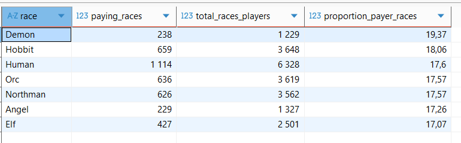
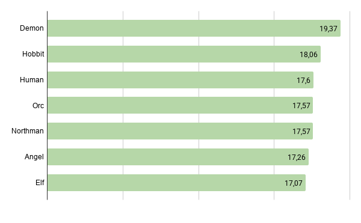
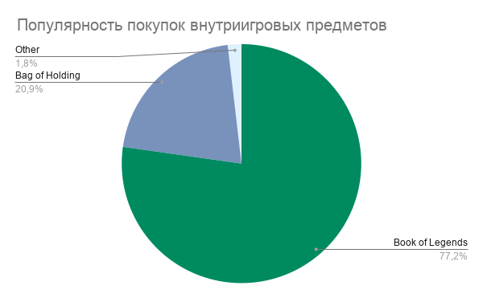
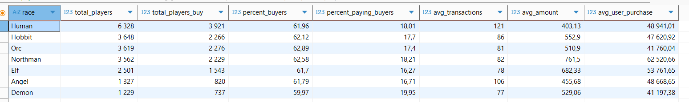

# 🎮 SQL-анализ игровой аналитики «Секреты Темнолесья»

## О проекте

Проект посвящен исследованию игровой активности пользователей многопользовательской онлайн-игры «Секреты Темнолесья».

В рамках проекта проведен исследовательский анализ данных и решена ad hoc-задача маркетинговой команды: изучено влияние игровых рас на покупательское поведение пользователей, а также проанализированы особенности внутриигровых покупок.

---

## Цель проекта

- определить долю платящих игроков;
- оценить влияние игровой расы на вероятность совершения покупок;
- исследовать структуру и стоимость внутриигровых покупок;
- выявить наиболее популярные игровые предметы;
- подготовить аналитические выводы и рекомендации для маркетинговой команды.

---

## Используемые инструменты

- PostgreSQL
- SQL
- DBeaver

---

## Описание данных

База данных включает **7 связанных таблиц**:

| Таблица | Описание |
|---------|----------|
| users | информация об игроках |
| events | данные о внутриигровых покупках |
| items | игровые предметы |
| race | игровые расы |
| classes | классы персонажей |
| skills | навыки персонажей |
| country | страны пользователей |

---

## Выполненная работа

В рамках проекта:

- провела предварительный исследовательский анализ данных
- рассчитала долю платящих игроков
- сравнила игровые расы по покупательской активности
- исследовала статистические характеристики внутриигровых покупок
- определила наиболее популярные эпические предметы
- подготовила рекомендации для маркетинговой команды

---

## Основные результаты

### Платящие игроки

- общая доля платящих игроков составила **17,7%**
- Разница между расами не превышает **2,3** процентных пункта, что говорит о равномерной склонности к покупкам независимо от расы. Однако `Демоны` и `Хоббиты` незначительно опережают других

### Внутриигровые покупки

- всего было сделано **1 307 678** внутриигровых покупок
- максимальная стоимость покупки **486 615,1**, минимальная  **0** (аномалии, вероятно промо-акции или тестовые покупки)
- аномальные покупки - покупки со стоимостью **0**, составляют всего **907**, процент незначителен, меньше **1% - 0,07%**
- медиана **74,86**, среняя стоимость **525,69**. Есть покупки, сильно превышающие по стоимости средние (выявлено наличие дорогих покупок, значительно влияющих на средний чек)

### Популярность предметов

На два игровых предмета приходится почти вся покупательская активность:

- **Book of Legends**
- **Bag of Holding**
  
На эти предметы приходится **86%** всех платящих пользователей, остальные эпические предметы имеют низкую популярность. 

### Зависимость активности игроков по совершению внутриигровых покупок от расы персонажа
 - покупка предметов примерно одинаковая среди всех рас, немного чаще совершают покупки раса `люди`
   

---
## Бизнес-выводы
- игровая раса практически не влияет на вероятность совершения покупки
- основной объем продаж формируют два наиболее популярных предмета
- раса `люди` чаще всего совершают недорогие покупки (в среднем **121** покупка при самом низком среднем чеке **403,1**)
- раса `северяне` имеет самый высокий средний чек (**761,50**, что на **88%** выше, чем у `людей`) - покупают самые дорогие предметы
- раса `демоны` покупает меньше предметов (в среднем 77 покупок), но чаще покупают внутриигровую валюту (самый больший % платящих игроков - **19,95%**). Вероятно, прохождение за Демонов меньше зависит от покупки предметов, чем у других рас.
- полученные результаты могут использоваться маркетинговой командой для анализа игрового баланса и оптимизации внутриигровой экономики
